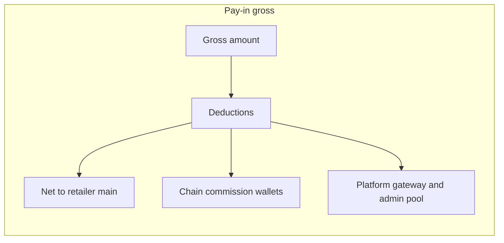

# Commission, hierarchy, and ledger integration plan

## Current state (already in repo)

- **Hierarchy storage:** [`backend/apps/users/models.py`](backend/apps/users/models.py) — `UserHierarchy` (parent/child), `get_subordinates()` for full downline, `_ROLE_CREATE_MATRIX` for who may onboard whom.
- **Pay-in deduction + upline roll-up:** [`backend/apps/fund_management/services.py`](backend/apps/fund_management/services.py) — `_compute_payin_distribution`, `_distribute_payin_commissions`, `_pay_chain_commission_slice`, `finalize_payin_success` / Razorpay path; upline walk in [`backend/apps/fund_management/payin_hierarchy.py`](backend/apps/fund_management/payin_hierarchy.py) (`upline_chain`).
- **Payout addition model + slabs:** Same `services.py` — `payout_slab_charge`, `process_payout` debits `amount + charge` from **main** after balance check; settings in [`backend/config/settings/payout_slab.py`](backend/config/settings/payout_slab.py)�7 / ₹15, boundary at ₹24,999 vs ≥��25,000 matches the examples).
- **MPIN:** [`backend/apps/fund_management/serializers.py`](backend/apps/fund_management/serializers.py) — payout serializer validates MPIN via `validate_mpin`.
- **Three wallets:** Created in [`backend/apps/users/services.py`](backend/apps/users/services.py); models in [`backend/apps/wallets/models.py`](backend/apps/wallets/models.py).
- **BBPS uses BBPS wallet only:** [`backend/apps/bbps/services.py`](backend/apps/bbps/services.py) — `process_bill_payment` checks and debits `bbps` wallet (requirement “fund BBPS before bill pay” is **partially** met: spending is correct; **funding path is missing** — see gaps).
- **Passbook + commission audit:** [`backend/apps/transactions/models.py`](backend/apps/transactions/models.py) — `PassbookEntry` (opening/closing, debit/credit per wallet), `CommissionLedger` with `meta` JSON.
- **Reports:** [`backend/apps/transactions/views.py`](backend/apps/transactions/views.py) — pay-in/payout/bbps/commission reports currently scoped to **`request.user` only**, not downline.

## Gaps vs client brief

| Requirement | Gap |
|-------------|-----|
| **SD cannot transact** | Not enforced server-side on payout/load-money/BBPS; frontend still shows **Bill Payments** (and likely fund flows) for SD in [`frontend/src/utils/rolePermissions.js`](frontend/src/utils/rolePermissions.js). |
| **SD “skip MD” onboarding** | Matrix allows SD → MD, DT, Retailer. Client text emphasizes onboarding DT/RT while skipping MD; **confirm** whether SD may still create MDs or only DT/RT. |
| **Agent details on every commission row** | [`_pay_chain_commission_slice`](backend/apps/fund_management/services.py) passbook description and `CommissionLedger.meta` only carry `slice`; need **payer** `user_id`, display name, role (and optional phone) on each credit. |
| **Passbook “service charges” column** | `PassbookEntry` has no dedicated charge field; payout uses one debit line for `amount + charge` (correct balance) but **charge is only in description** — reports/UI may need structured fields. |
| **Main → BBPS transfer** | No API in [`backend/apps/wallets/`](backend/apps/wallets/) to move funds main → bbps with atomic passbook lines. |
| **Team / downline reports** | All report views filter `user=request.user`; managers need **team activity** (pay-in, payout, passbook subset, commission from downline-generated business). |
| **Contact resolution by phone** | Backend pay-in already takes `contact_id`; frontend must consistently **lookup contacts by phone** via Contacts API before moving money (verify [`frontend/src/components/fundManagement/LoadMoney.jsx`](frontend/src/components/fundManagement/LoadMoney.jsx) / [`Payout.jsx`](frontend/src/components/fundManagement/Payout.jsx) / typeahead). |

## Implementation approach (non-breaking)

1. **Backend: role guard for “no transact” roles**  
   - Add a small helper (e.g. `assert_can_perform_financial_txn(user)` in [`backend/apps/core/utils.py`](backend/apps/core/utils.py) or fund_management) that raises a clear 403 for `Super Distributor` (and any future read-only roles).  
   - Call it at the start of: pay-in order/create/complete paths, `process_payout`, BBPS pay, and any future wallet-transfer endpoint.  
   - Keeps existing behavior for retailers/distributors/etc.

2. **Backend: wallet transfer main → BBPS**  
   - New authenticated POST under wallets or fund-management: `amount`, optional `mpin` if you want parity with payout.  
   - Atomic: debit main, credit bbps, two passbook lines (or one paired reference), `Transaction` optional or dedicated `service` constant in passbook only — **prefer minimal new tables**; reuse `PassbookEntry` with `service='WALLET_TRANSFER'`.

3. **Backend: enrich commission attribution**  
   - Extend `_pay_chain_commission_slice` (and platform ledger rows where useful) to set `meta` on `CommissionLedger`: e.g. `source_user_id`, `source_user_code`, `source_role`, `source_name`.  
   - Append the same info to passbook `description` or add nullable `PassbookEntry.service_charge` / `related_user_id` only if serializers/reports need structured filters — **if adding columns**, add a migration and backfill is unnecessary for old rows.

4. **Backend: downline-scoped reporting**  
   - Add query param `scope=self|team` (default `self`) on pay-in, payout, bbps, passbook list, and/or a dedicated `GET /api/reports/team-activity/` that:  
     - Resolves `team_user_ids = {request.user.id} ∪ ids from UserHierarchy.get_subordinates(request.user)` (Admin: all users or keep existing admin global rules per product).  
     - Filters `Transaction` / `PassbookEntry` / `CommissionLedger` accordingly with date filters.  
   - Enforce permission: only MD, DT, SD (and Admin) may use `scope=team`; retailers get 403.

5. **Backend: payout passbook clarity (optional but aligned with SBI-style)**  
   - Either split into two passbook lines (principal debit + charge debit) or add `service_charge` on the single line — choose one style and use consistently in serializers.

6. **Frontend**  
   - **SD:** Remove or hide Load Money, Payout, Bill Pay routes/menu items; rely on API403 as backup.  
   - **Managers:** Add “Team” toggle or separate report pages calling `scope=team`.  
   - **Commission report:** Display parsed `meta` agent fields from API if exposed via serializer.  
   - **BBPS:** Add “Transfer to BBPS wallet” screen calling new endpoint.

7. **Hierarchy matrix**  
   - After client confirmation, adjust `_ROLE_CREATE_MATRIX` for `Super Distributor` if they must not create Master Distributors.

8. **Tests**  
   - Pay-in: commission `meta` contains payer identity; roll-up still sums to package percentages.  
   - Payout: ₹24,999 → charge 7; ₹25,000 → 15; SD blocked.  
   - BBPS: insufficient bbps balance; success after transfer.  
   - Report: manager sees subordinate txns only.

## Risk and compatibility notes

- **Package seed / percentages:** Client example (1% + 0.24% +0.01% + 0.02% + 0.03% + 0.06% retailer absorbed) must match active `PayInPackage` rows in DB; code already respects package fields — verify [`backend/apps/fund_management/migrations/0003_seed_pay_in_packages.py`](backend/apps/fund_management/migrations/0003_seed_pay_in_packages.py) or admin-configured packages.  
- **Gateway1% “to provider”:** Today gateway share is credited via [`_credit_platform_payin_slices`](backend/apps/fund_management/services.py) to platform recipients — document whether that matches finance ops or remains ledger-only.

## Client confirmation (short)

- Should **Super Distributor** still be allowed to onboard **Master Distributors**, or only **Distributor / Retailer**?  
- For passbook, prefer **two lines** for payout (amount vs charge) vs a **single line + structured charge field**?
